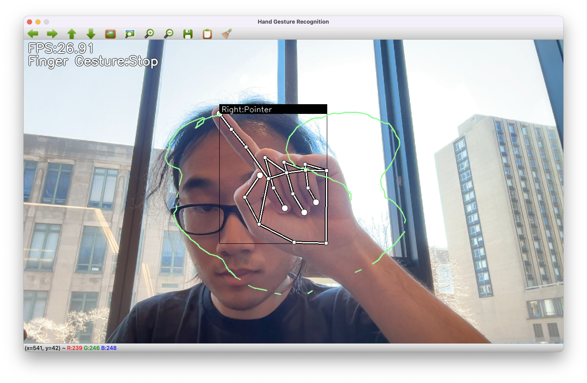

# **GestureGenius**

## Description
👋 Developing virtual whiteboard utilizing hand gestures for educators and students for remote teaching.

Demo of Project

## Demo
https://youtu.be/mmD74B2AR5g

## Devpost
https://devpost.com/software/gesturegenius

## Contributors
- Richard Liu (ruicliu@bu.edu)
- Dylan Ramdhan (dylram01@bu.edu)
- Wesley Choi (wesc01@bu.edu)
- Alan Grissette (hsalley@bu.edu)

## Resources
[kinivi - Hand Gesture Recognition](https://github.com/kinivi/hand-gesture-recognition-mediapipe/tree/main)
